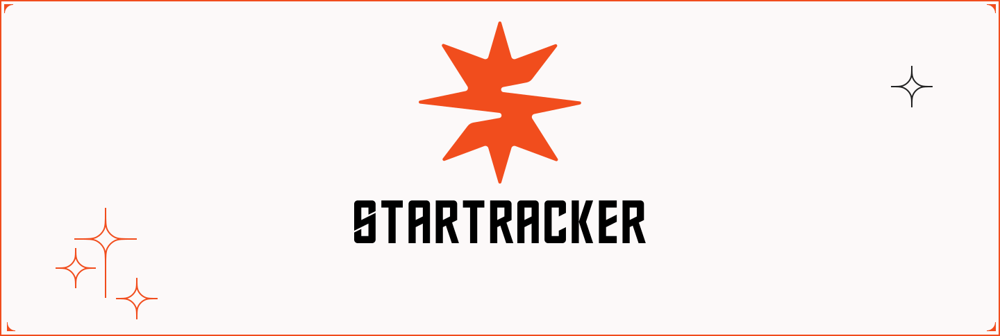

# StarTracker - SSV Operators Nodes Tracker

StarTracker is a geo-tracking tool designed for the SSV network. To ensure easy maintenance, StarTracker relies on the code of [ssv](https://github.com/bloxapp/ssv) core node for discovery purposes.

StarTracker continuously discovers peers within the network and utilizes [maxminddb-golang](github.com/oschwald/maxminddb-golang) to obtain the location from IP addresses.

## Build

```
docker build -t stakestar/startracker:latest .
```

## Run

Using docker

```
docker run stakestar/startracker --db-path=data/nodes.db --geodb-path=GeoLite2-City.mmdb
```

Or using docker compose

```
docker compose up -d
```

## API Interface

### Get all nodes

```
GET /api/nodes

{
    "metadata": {
        "count": 111
    },
    "nodes": [
        {
            "updated_at": "2023-03-09T11:47:55.513863822Z",
            "geo_data": {
                "country_code": "HK",
                "country_name": "Hong Kong",
                "city": "",
                "latitude": 22.2578,
                "longitude": 114.1657,
                "accuracy_radius": 1000
            },
            "node_version": "v0.4.0",
            "operator_id": "008237da4cab519e86c166ed02e5ea1cd54206722f648b239b74843b15327bac"
        },
        ...
    ]
}
```

### Get node by Operator PubKey

```
GET /api/nodes/pubkey/{pubkey}

{
    "updated_at": "2023-03-09T11:08:36.640389198Z",
    "geo_data": {
        "country_code": "DE",
        "country_name": "Germany",
        "city": "Frankfurt am Main",
        "latitude": 50.1188,
        "longitude": 8.6843,
        "accuracy_radius": 1000
    },
    "node_version": "v0.4.0",
    "operator_id": "ba19a7f54041d4e307a576c96ae46563480e061c36df88a7381101df17fbfa91"
}
```

### Get node by Operator ID

```
GET /api/nodes/operatorid/{operatorid}

{
    "updated_at": "2023-03-09T11:08:36.640389198Z",
    "geo_data": {
        "country_code": "DE",
        "country_name": "Germany",
        "city": "Frankfurt am Main",
        "latitude": 50.1188,
        "longitude": 8.6843,
        "accuracy_radius": 1000
    },
    "node_version": "v0.4.0",
    "operator_id": "ba19a7f54041d4e307a576c96ae46563480e061c36df88a7381101df17fbfa91"
}
```

## License

 GPL-3.0 license 